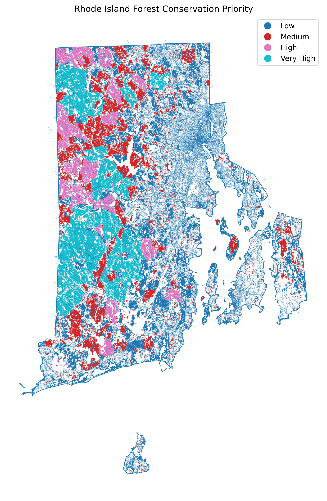

# Rhode Island Forest Fragmentation Workflow

Python workflow for Rhode Island forest fragmentation analysis using NLCD land cover, OpenStreetMap roads, and RIGIS boundaries. The workflow builds a statewide forest fragmentation model, calculates core forest, connectivity, road-impact, and patch metrics, and can summarize those results to custom parcel or private forest polygons.

## Project Goal

This project demonstrates how to generate spatial biodiversity-related features from public geospatial datasets.

The main workflow:

1. Downloads Rhode Island boundary and road data
2. Downloads and clips NLCD land cover to Rhode Island
3. Extracts forest cover from NLCD classes
4. Identifies forest patches
5. Calculates fragmentation-related metrics
6. Produces a statewide forest fragmentation GeoPackage
7. Optionally summarizes fragmentation metrics to custom polygons, such as parcels or private forest patches

## Why Fragmentation?

Forest fragmentation is an important proxy for biodiversity and conservation value. Larger, more connected, less road-impacted forest patches generally provide better habitat conditions than small, isolated, edge-dominated patches.

This workflow calculates metrics such as:

- Forest patch area
- Core forest area
- Road-impact percentage
- Patch compactness
- Nearby-patch connectivity
- Statewide conservation / fragmentation ranking

## Repository Structure

```text
ri-forest-conservation/
├── .devcontainer/
│   └── devcontainer.json
├── src/
│   ├── download_data.py
│   ├── download_nlcd.py
│   ├── workflow.py
│   └── summarize_custom_polygons.py
├── requirements.txt
├── README.md
└── .gitignore


## Example Output

The statewide workflow produces a forest fragmentation priority map. Higher-priority areas generally represent larger, more connected, lower-road-impact forest patches with more core forest.


